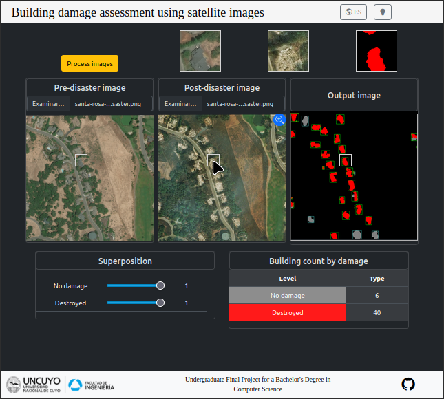

# Damage assessment in cities caused by natural disasters using Machine Learning
## Bachelor's Degree in Computer Science 

Final degree in computer science project from *Universidad Nacional de Cuyo, facultad de ingeniería*, focused on **Deep Learning** (DL) applied to **Building Damage Assessment** (BDA) using Very High Resolution (VHR) satellite images from the xBD dataset, part of the xView2 competition. 

This project involves the development of a preprocessing pipeline for cropping, augmenting, and sampling xBD dataset images, as well as a multitask training pipeline for a deep learning model focused on the segmentation and damage classification of each building in pre- and post-disaster images. Additionally, it includes a postprocessing pipeline for counting buildings, generating bounding boxes, and performing object-level evaluation. This project also includes a prototype webpage as a practical application of the DL model, demonstrating its functionality.

**Jump to:**
1. [Folder Structure](#master-branch-folder-structure)
2. [Dataset xBD](#data-sources)
3. [Preprocessing Pipeline](#data-processing)
4. [Deep Learning Model](#overview-of-the-model)
5. [Experiments](#experiments)
6. [Postprocessing Pipeline](#postprocessing-pipeline)
7. [How to Run the training pipeline](#how-to-run-the-web-page)
8. [Results](#results)
9. [Web page](#web-page)


## Folder structure
    .
    ├── README.md                      <- Top-level README for developers using this project.
    ├── LICENSE                        <- License file for the project.
    ├── environment.yml                <- Conda environment file listing the libraries used in this project.
    ├── notebooks/                     <- Jupyter notebooks for dataset exploration and result analysis.
    ├── submit/                        <- Code used to train the model on a cluster using Slurm.
    |── src/                           <- Source code for the project.
    |    ├── models/                   <- Scripts defining the model architecture.
    |    ├── preprocessing/            <- Scripts for the data preprocessing pipeline.
    |    ├── training/                 <- Scripts for the model training and evaluation pipeline.
    |    ├── postprocessing/           <- Scripts for the output postprocessing pipeline.        
    |    ├── utils/                    <- Utility scripts shared across other modules.
    |    ├── run_definitive_training.py<- Script to run the final training phase.
    |    ├── run_on_test.py            <- Script to evaluate the model on the test dataset.
    |    ├── run_parameter_search.py   <- Script to perform hyperparameter search.
    |    ├── run_postprocessing.py     <- Script to run the postprocessing pipeline.
    |    ├── run_preprocessing.py      <- Script to run the preprocessing pipeline.
    |    └── env.sh                    <- Environment setup script to run src.
    └── web_page/                      <- Showcase webpage source cod

## Dataset xBD

We used [xBD dataset](https://xview2.org/), a publicly available dataset, to train and evaluate our proposed network performance. Detailed information about this dataset is provided in ["xBD: A Dataset for Assessing Building Damage from Satellite Imagery"](https://arxiv.org/abs/1911.09296) by Ritwik Gupta et al. The data exploration is shown in the `1-Data_analisis.ipynb` notebook.

## Preprocessing Pipeline

For data preprocessing, we followed these steps:
1. Generated segmentation masks from the label JSON files.
2. Applied a greedy sampling strategy to select balanced images (if applied in experiment).
3. Split the dataset into training (90%) and test (10%) sets.
4. CutMix-based data augmentation to balance the damaged building dataset (if applied in experiment).
5. Calculated image statistics for normalization.
6. Cropped 1024x1024 images into 256x256 patches

## Overview of the model

The model proposed in the original repository shares some characteristics with ["An Attention-Based System for Damage Assessment Using Satellite Imagery"](https://arxiv.org/pdf/2004.06643v1.pdf) by Hanxiang Hao et al. However, we do not incorporate any attention mechanism for the segmentation arm, which is a UNet approach. The modelo is trained with Adam Optimizer, Weights Initializer Xavier Uniform and the Loss function Categorical cross Entropy for each output. Details of our architecture are shown below:


## Experiments

In this project we made four main experiments to evaluate the performance of the trainable model using a different number of images each time:
1. Address imbalance with *weighted training* technique.
2. Address imbalance with *CutMix-inspired* technique.
3. Address imbalance with proposed *greedy sampling* technique and 1000 training images.
4. Address imbalance with proposed *greedy sampling* technique and 3000 training images.

## Postprocessing Pipeline

The steps followed during postprocessing are:
1. Merging patches into 1024x1024 predicted mask image.
2. Creating predicted bounding boxes.
3. Computing metrics of pixel level evaluation for the all predicted images.
4. Computing metrics of object level evaluation for the all predicted images. 

## How to Run the Model Training Pipeline

This project uses [Miniconda](https://docs.conda.io/projects/conda/en/latest/index.html) for package and environment management. You can install Miniconda from [here](https://docs.anaconda.com/miniconda/).

1. **Clone this repository:**
    ```bash
    git clone git@github.com:MrtC101/Thesis_DL_for_BDA.git
    ```

2. **Create a new Conda environment** using the Python version and libraries specified in `environment.yml`:
    ```bash
    conda env create -f ./environment.yml
    ```

3. **Download the complete xBD Dataset** from the [official website](https://xview2.org/dataset).

4. **Create an experiment or output folder** in the root of the project folder and inside the experiment folder, store a YAML file named "params.yml". You can copy the content from the sample experiment folder in the root project.
    ```
    Exp10/
    └── params.yml -> Experiment configuration file
    ```
5. **Modify the `./src/env.sh` file** as follows:
    ```bash
    export PROJ_PATH="project root path"
    export EXP_NAME="experiment folder name"
    export XBD_PATH="xBD dataset folder path"
    export CONF_NUM=0 # Configuration identifier number to use with k-fold cross-validation
    export EXP_PATH="$PROJ_PATH/$EXP_NAME"
    export SRC_PATH="$PROJ_PATH/src"
    export DATA_PATH="$EXP_PATH/data"
    export OUT_PATH="$EXP_PATH/out"
    ```

7. **Run the training phase**. Execute the `RUN.sh` bash script to start the training. This script will perform all phases of the model training pipeline, including:
    - Data preprocessing of xBD dataset.
    - k-Cross Validation based on the specified configuration in the environment variable.
    - Training the final machine learning model using the best configuration (or the only configuration available).
    - Postprocessing using predictions generated from the test data.
    ```bash
        source RUN.sh
    ```
   
8. **The pipeline results** will be stored with a structure similar to that of the `./Sample Experiment/` directory in the experiment output directory:
    ```
    Example Experiment
    ├── data -> Created patches and split JSON files directory
    └── out -> Experiment results and processing logs
        ├── config-0 -> Configuration 0 results
        │   ├── 5-fold_0 -> Fold training results
        │   │   ├── checkpoints -> Checkpoints and best epoch weights
        │   │   ├── configs -> Configuration used in this training fold
        │   │   ├── tb_logs -> Logs for TensorBoard
        │   │   └── metrics
        │   ├── 5-fold_1
        │   ├── 5-fold_2
        │   ├── 5-fold_3
        │   └── 5-fold_4
        ├── config-1
        ├── final_model -> Model trained on all training data with the best configuration
        │   ├── checkpoints
        │   ├── configs
        │   ├── console_logs -> Console output logs
        │   ├── metrics -> Pixel-level metrics over all epochs
        │   └── test_pred_masks -> Predicted masks for test patches
        ├── postprocessing
        │   ├── hurricane-florence_00000026 -> Example of image patch merge and metrics from test split
        │   └── metrics -> Object-level metrics over the entire test split
        ├── preprocessing -> Preprocessing logs
        └── params.yml -> Experiment configuration file
    ```


## Results
For the evaluation of the model performance after each training we used the follow metrics:
- Accuracy (ACC)
- Recall (R)
- Precision (P)
- F1-score (F1)
- Harmonic Mean F1-score (HMF1) (Used to summarize segmentation and clarification performance)

Here is shown the table metrics of the best trained model from experiment 4 with 50 epochs:

| Split | Tiles |
|-------|-------|
|train  | 2400  |
|val    | 300   |
|test   | 300   |

| Split          | Class          | HMF1   | P      | R      | F1     | ACC    |
|----------------|----------------|--------|--------|--------|--------|--------|
|                | *background*   | 0.8870 | 0.9934 | 0.9953 | 0.9944 | 0.9890 |
|                | *building*     |        | 0.8272 | 0.7754 | 0.8005 | 0.9890 |
|                |----------------|--------|--------|--------|--------|--------|
|                | *background*   |        | 0.9936 | 0.9953 | 0.9945 | 0.9892 |
| **Validation** | *no-damage*    |        | 0.7196 | 0.6577 | 0.6872 | 0.9908 |
|                | *minor-damage* | 0.5701 | 0.3459 | 0.3523 | 0.3491 | 0.9953 |
|                | *major-damage* |        | 0.4927 | 0.4870 | 0.4898 | 0.9956 |
|                | *destroyed*    |        | 0.7435 | 0.6843 | 0.7127 | 0.9975 |
|----------------|----------------|--------|--------|--------|--------|--------|
|                | *background*   | 0.8880 | 0.9916 | 0.9945 | 0.9930 | 0.9866 |
|                | *building*     |        | 0.8375 | 0.7712 | 0.8030 | 0.9866 |
|                |----------------|--------|--------|--------|--------|--------|
|                | *background*   |        | 0.9919 | 0.9944 | 0.9932 | 0.9868 |
|   **Test**     | *no-damage*    |        | 0.7217 | 0.6401 | 0.6785 | 0.9884 |
|                | *minor-damage* | 0.5776 | 0.3867 | 0.3150 | 0.3472 | 0.9940 |
|                | *major-damage* |        | 0.4927 | 0.5558 | 0.5224 | 0.9943 |
|                | *destroyed*    |        | 0.7283 | 0.7192 | 0.7237 | 0.9973 |
|----------------|----------------|--------|--------|--------|--------|--------|

## Web page

For this thesis, we developed a demo web page to visualize the performance of the trained model and to demonstrate a practical application.




### How to Run the Web Page

This project uses [Miniconda](https://docs.conda.io/projects/conda/en/latest/index.html) for package and environment management. You can install Miniconda from [here](https://docs.anaconda.com/miniconda/).

1. **Clone this repository:**
    ```bash
    git clone git@github.com:MrtC101/Thesis_DL_for_BDA.git
    cd Thesis_DL_for_BDA
    ```

2. **Create a new Conda environment** using the specified Python version and libraries in the `environment.yml` file located in the root folder:
    ```bash
    conda env create -f environment.yml
    ```

3. **Run the web application** on your local machine (default port: 8000):
    ```bash
    source ./RUN_WEB.sh
    ```

Your web application should now be accessible at `http://127.0.0.1:8000`.

## Authors

- Student: ***Martín Cogo Belver***
- Tutor: ***Dra. Ana Carolina Olivera***