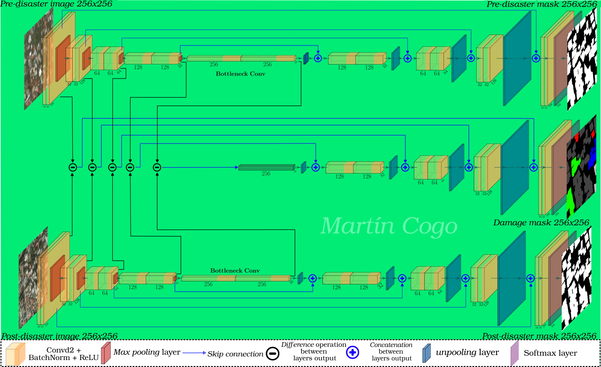
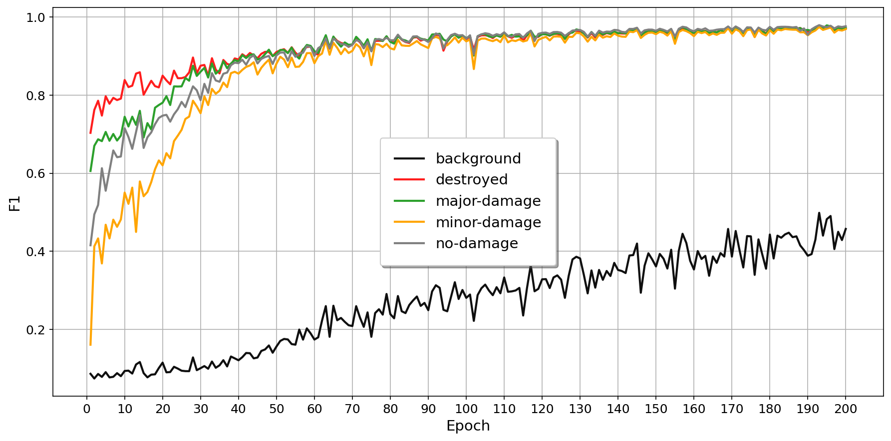
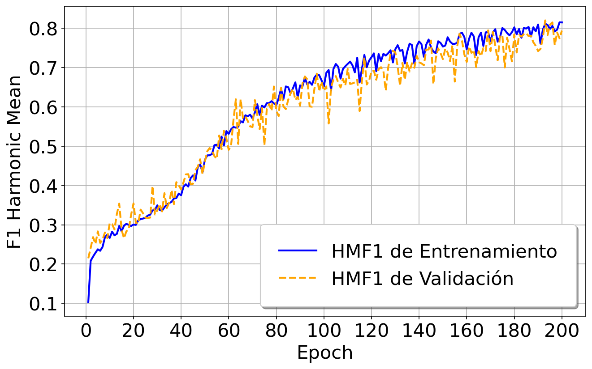
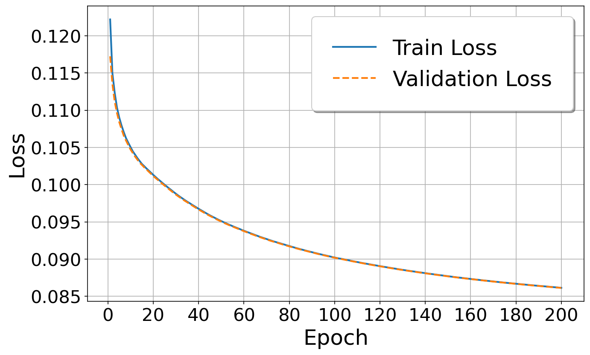
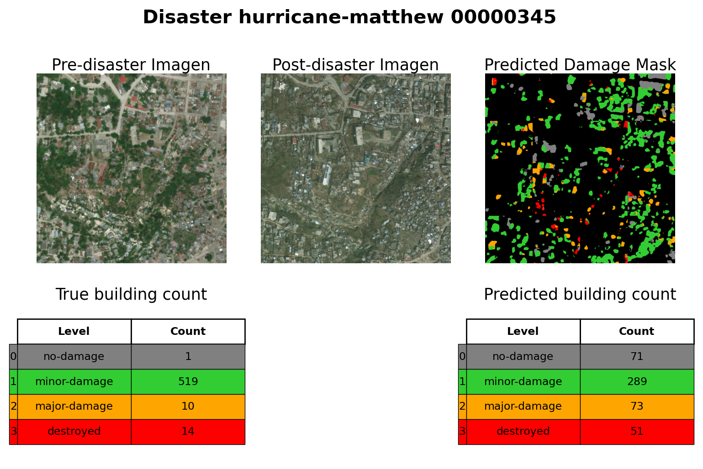

# Bachelor's Degree in Computer Science Assessment of damage in cities caused by natural disasters using Machine Learning

Final degree in computer science project from *Universidad Nacional de Cuyo, facultad de ingeniería*, focused on **Deep Learning** (DL) applied to **Building Damage Assessment** (BDA) using Very High Resolution (VHR) satellite images from the xBD dataset, part of the xView2 competition. 

This project involves the development of a preprocessing pipeline for cropping, augmenting, and sampling xBD dataset images, as well as a multitask training pipeline for a deep learning model focused on the segmentation and damage classification of each building in pre- and post-disaster images. Additionally, it includes a postprocessing pipeline for counting buildings, generating bounding boxes, and performing object-level evaluation. This project also includes a prototype webpage as a practical application of the DL model, demonstrating its functionality.

**Jump to:**
1. [Folder Structure](#master-branch-folder-structure)
1. [Dataset xBD](#data-sources)
1. [Preprocessing Pipeline](#data-processing)
1. [Overview of the model](#overview-of-the-model)
1. [Results](#results)

## Folder structure
    .
    ├── README.md                      <- Top-level README for developers using this project.
    ├── LICENSE                        <- License file for the project.
    ├── environment.yml                <- Conda environment file listing the libraries used in this project.
    ├── notebooks/                     <- Jupyter notebooks for dataset exploration and result analysis.
    ├── submit/                        <- Code used to train the model on a cluster using Slurm.
    |── src/                           <- Source code for the project.
    |    ├── models/                   <- Scripts defining the model architecture.
    |    ├── preprocessing/            <- Scripts for the data preprocessing pipeline.
    |    ├── training/                 <- Scripts for the model training and evaluation pipeline.
    |    ├── postprocessing/           <- Scripts for the output postprocessing pipeline.        
    |    ├── utils/                    <- Utility scripts shared across other modules.
    |    ├── run_definitive_training.py<- Script to run the final training phase.
    |    ├── run_on_test.py            <- Script to evaluate the model on the test dataset.
    |    ├── run_parameter_search.py   <- Script to perform hyperparameter search.
    |    ├── run_postprocessing.py     <- Script to run the postprocessing pipeline.
    |    ├── run_preprocessing.py      <- Script to run the preprocessing pipeline.
    |    └── env.sh                    <- Environment setup script to run src.
    └── web_page/                      <- Showcase webpage source code

## Dataset xBD

We used [xBD dataset](https://xview2.org/), a publicly available dataset, to train and evaluate our proposed network performance. Detailed information about this dataset is provided in ["xBD: A Dataset for Assessing Building Damage from Satellite Imagery"](https://arxiv.org/abs/1911.09296) by Ritwik Gupta et al. The data exploration is shown in the `1-Data_analisis.ipynb` notebook.

## Preprocessing Pipeline

For data preprocessing, we followed these steps:
1. Generated segmentation masks from the label JSON files.
2. Applied a greedy sampling strategy to select balanced images (if applied in experiment).
3. Split the dataset into training (90%) and test (10%) sets.
4. CutMix-based data augmentation to balance the damaged building dataset (if applied in experiment).
5. Calculated image statistics for normalization.
6. Cropped 1024x1024 images into 256x256 patches

## Training features

### Overview of the model

The model proposed in the original repository shares some characteristics with ["An Attention-Based System for Damage Assessment Using Satellite Imagery"](https://arxiv.org/pdf/2004.06643v1.pdf) by Hanxiang Hao et al. However, we do not incorporate any attention mechanism for the segmentation arm, which is a UNet approach. The modelo is trained with Adam Optimizer, Weights Initializer Xavier Uniform and the Loss function Categorical cross Entropy for each output. Details of our architecture are shown below:

### Experiments

In this project we made four main experiments to evaluate the performance of the trainable model using a different number of images each time:
1. Training time comparative between two clusters using only cpu and gpu.
2. Training the model only using weighted loss function.
3. Training with a CutMixed approach for dataset balancing.
4. Training with a greedy sampling strategy for dataset balancing.

## Postprocessing Pipeline

The steps followed during postprocessing are:
1. Merging patches into 1024x1024 predicted mask image.
2. Creating predicted bounding boxes.
3. Computing metrics of pixel level evaluation for the all predicted images.
4. Computing metrics of object level evaluation for the all predicted images. 

## Results
For the evaluation of the model performance after each training we used the follow metrics:
- Accuracy (ACC)
- Recall (R)
- Precision (P)
- F1-score (F1)
- Harmonic Mean F1-score (HMF1) (Used to summarize segmentation and clarification performance)

Here is shown the table metrics of the best trained mode from experiment 4:

train set = 1000 imgs | test = 111 |
Mejor Configuración: 7 | 
Mejor época: 193       |
*val\_loss* = 0.0863   |
*test\_loss* = 0.1263

| Split          | Class          | HMF1   | P      | R      | F1     | ACC    |
|----------------|----------------|--------|--------|--------|--------|--------|
|                | *background*   | 0.5567 | 0.3108 | 0.5108 | 0.3864 | 0.9573 |
|                | *building*     |        | 1.0000 | 0.9901 | 0.9950 | 0.9996 |
|                |----------------|--------|--------|--------|--------|--------|
|                | *background*   |        | 0.3108 | 0.5108 | 0.3864 | 0.9573 |
| **Validación** | *no-damage*    |        | 0.9747 | 0.9591 | 0.9668 | 0.9992 |
|                | *minor-damage* | 0.7401 | 0.9549 | 0.9573 | 0.9561 | 0.9993 |
|                | *major-damage* |        | 0.9643 | 0.9680 | 0.9662 | 0.9991 |
|                | *destroyed*    |        | 0.9737 | 0.9267 | 0.9496 | 0.9992 |
|----------------|----------------|--------|--------|--------|--------|--------|
|                | *background*   | 0.3209 | 0.1608 | 0.2389 | 0.1922 | 0.7934 |
|                | *building*     |        | 1.0000 | 0.9454 | 0.9719 | 0.9967 |
|                |----------------|--------|--------|--------|--------|--------|
|                | *background*   |        | 0.1608 | 0.2389 | 0.1922 | 0.7934 |
|   **Prueba**   | *no-damage*    |        | 0.7041 | 0.6811 | 0.6924 | 0.9907 |
|                | *minor-damage* | 0.4384 | 0.4521 | 0.4404 | 0.4461 | 0.9904 |
|                | *major-damage* |        | 0.7386 | 0.7821 | 0.7597 | 0.9917 |
|                | *destroyed*    |        | 0.9118 | 0.7691 | 0.8344 | 0.9957 |
|----------------|----------------|--------|--------|--------|--------|--------|

This plot shows the evolution of the métric F1 for damage clasification of each class over the validation set.

This plot shows the evolution of the métric HMF1 for the damage clasification task over the validation set..

This plot shows the evolution of the loss function for the damage mask output over the epochs over the validation set.

This is an example of a prediction achived with the model.

## Author

- Student: ***Martín Cogo Belver***
- Tutor: ***Dra. Ana Carolina Olivera***